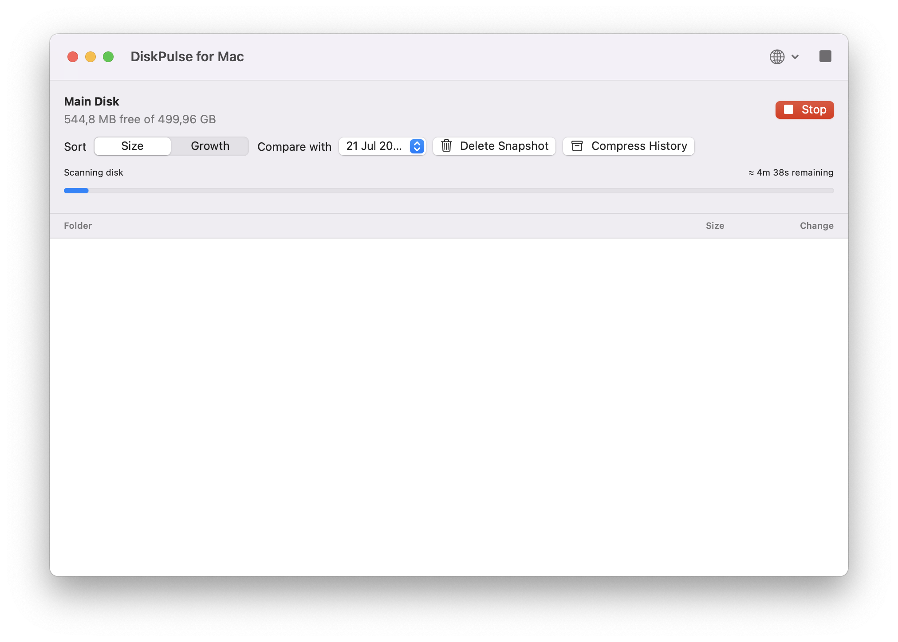
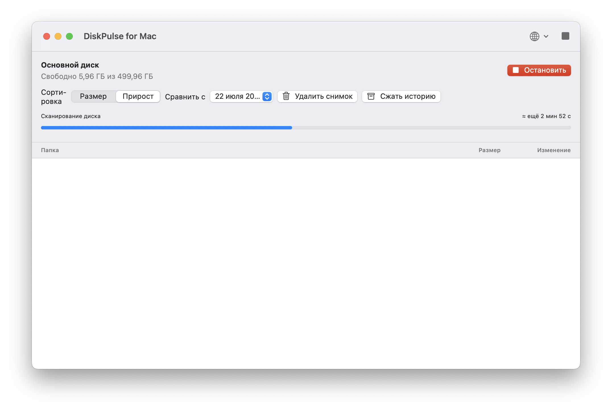
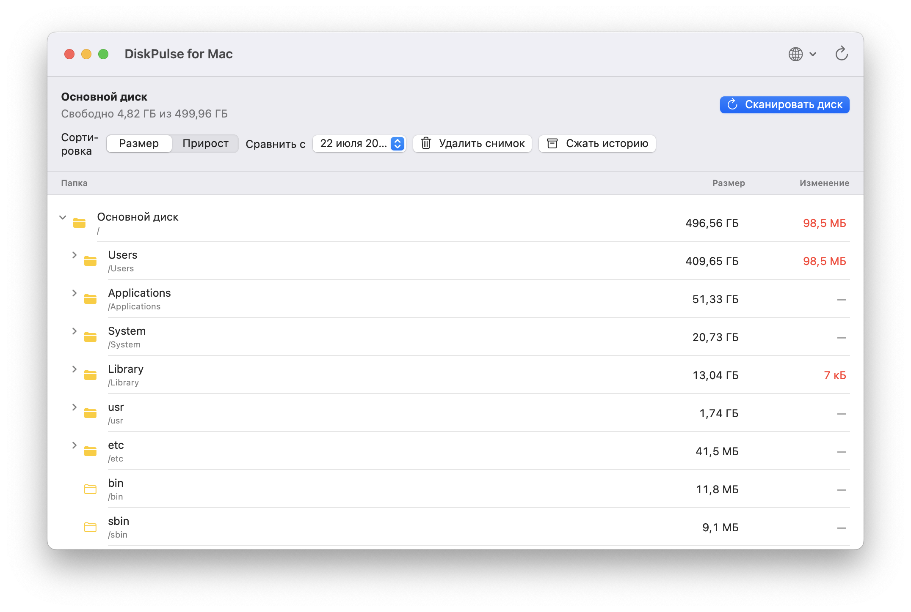

# DiskPulse for Mac

DiskPulse for Mac is a private, local disk-space monitor for macOS. It shows which folders use the most storage and how their sizes change over time.

[Русская версия](#русская-версия) · [Installation](#installation) · [Установка](#установка)

## Features

- Scan the main disk and explore folders in a Finder-like tree.
- Create folder-size snapshots and track their growth or reduction over time.
- Sort folders by current size or growth since a selected snapshot.
- Compare saved snapshots and remove unneeded ones.
- Open a folder directly in Finder from the context menu.
- Copy a full folder path, including the disk name, from the context menu.
- Choose an accelerated scan of changed folders or a full disk scan.
- See the scan type, live progress, estimate, and elapsed scan time.
- Confirm before stopping a scan by accident.
- Use the app in English or Russian.
- Keep local history in compressed SQLite storage; the ten newest snapshots are retained.
- Send feedback or report a bug from the About window.
- Check GitHub Releases for a newer version from the About window and download its installer.

## Screenshots

### English

Disk scan with an estimated time remaining and a stop button:



Finder-like folder tree with size and growth columns:


### Русский

Сканирование диска с прогнозом времени и кнопкой остановки:



Дерево папок в стиле Finder с колонками размера и прироста:



## Installation

Download the latest release from the repository's [Releases](https://github.com/djperov/diskpulse-for-mac/releases) page.

1. Download `DiskPulse-for-Mac-1.1.0.dmg`.
2. Move **DiskPulse for Mac.app** to the **Applications** folder.
3. Open the app.
4. For a complete scan, allow **Full Disk Access** in **System Settings → Privacy & Security → Full Disk Access**.

DiskPulse stores its local database at:

```text
~/Library/Application Support/DiskPulse/history.sqlite
```

No files leave your Mac. SQLite is included with macOS; no extra installation is required.

## Build from source

1. Install Xcode 16 or newer.
2. Open `Package.swift` in Xcode.
3. Select the `MestoNaMak` scheme and click **Run**.

## License

MIT License. See `LICENSE`.

---

# Русская версия

DiskPulse for Mac — локальное приложение для macOS, которое показывает, какие папки занимают место на диске и как их размер меняется со временем.

## Возможности

- Сканирование основного диска и дерево папок в стиле Finder.
- Создание снимков размера папок и отслеживание их увеличения или уменьшения со временем.
- Сортировка по текущему размеру или приросту относительно выбранного снимка.
- Сравнение снимков, удаление ненужных записей истории.
- Открытие выбранной папки в Finder по правой кнопке мыши.
- Копирование полного пути к папке вместе с именем диска.
- Выбор ускоренного сканирования изменённых папок или полного сканирования диска.
- Отображение типа сканирования, прогноза, прогресса и секундомера.
- Подтверждение перед остановкой сканирования.
- Русский и английский интерфейс.
- Сжатая история в SQLite; приложение хранит десять последних снимков.
- Отправка отзыва или сообщения об ошибке из окна «О программе».
- Проверка новой версии в GitHub Releases и скачивание установщика из окна «О программе».

## Скриншоты

Сканирование диска с прогнозом времени и кнопкой остановки:


Дерево папок в стиле Finder с колонками размера и прироста:


## Установка

Скачайте последнюю версию на странице [Releases](https://github.com/djperov/diskpulse-for-mac/releases) этого репозитория.

1. Скачайте `DiskPulse-for-Mac-1.1.0.dmg`.
2. Перенесите **DiskPulse for Mac.app** в папку «Программы».
3. Откройте приложение.
4. Для полного сканирования разрешите «Полный доступ к диску»: **Системные настройки → Конфиденциальность и безопасность → Полный доступ к диску**.

Данные приложения хранятся только на вашем Mac:

```text
~/Library/Application Support/DiskPulse/history.sqlite
```

Никакие файлы не отправляются в интернет. SQLite уже входит в macOS, ничего дополнительно устанавливать не нужно.
